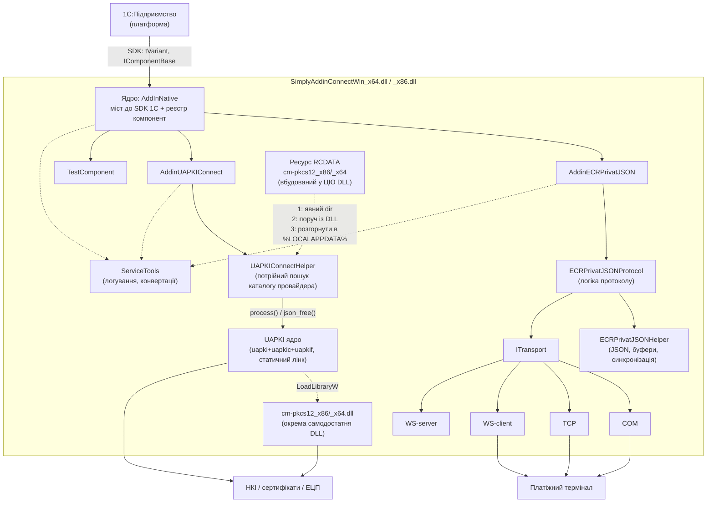

# Архітектура SimplyAddinConnect

Опис архітектури зовнішньої компоненти 1С **SimplyAddinConnect** — від точки входу
DLL до конкретних інтеграцій (платіжний термінал ПриватБанку, крипто-бібліотека UAPKI).

Документ описує поточний стан коду (гілки `add_UAPKI`). Команди збірки й конвенції коду
див. у кореневому `AGENTS.md`.

---

## 1. Загальний огляд

Проєкт компілюється в **одну DLL** (окремо x86 і x64), яку 1С підключає як зовнішню
нативну компоненту. Усередині DLL реалізовано кілька **компонент** (кожна доступна в 1С
під власним іменем), що стоять на спільному ядрі-мості до SDK 1С.

Архітектура — шарова. Верхні шари не знають про деталі нижніх; зв'язок — через інтерфейси
(`IComponentBase`, `ITransport`) і хелпери.



**Шари:**

| Шар | Файли | Роль |
|---|---|---|
| Ядро (bridge) | `src/core/AddInNative.*` | Реалізація SDK 1С, реєстр компонент, VariantHelper |
| Компоненти | `src/components/*` | Фасади, що реєструють методи для 1С |
| Протоколи | `src/protocols/*` | Бізнес-логіка взаємодії з пристроєм |
| Хелпери | `src/helpers/*` | Допоміжна логіка (JSON, буфери, обгортки бібліотек) |
| Транспорт | `src/transport/*` | Канали зв'язку (COM/TCP/WebSocket) |
| Сервіси | `src/helpers/ServiceTools*` | Наскрізне логування та конвертації рядків |

---

## 2. Ядро: `AddInNative`

`src/core/AddInNative.h/.cpp` — базовий клас усіх компонент. Реалізує інтерфейс
`IComponentBase` зі SDK 1С (`include/`) і приховує всю рутину роботи з `tVariant`,
менеджером пам'яті та інтроспекцією методів/властивостей.

### 2.1. Точка входу та реєстр компонент

Одна DLL може містити багато компонент. Реєстр — статична мапа:

```cpp
static std::map<std::u16string, CompFunction> components;   // ім'я 1С → фабрика
static std::u16string AddComponent(name, creator);          // реєструє компоненту
static AddInNative* CreateObject(const std::u16string& name);
```

1С викликає дві експортовані функції (friend-функції ядра):
- `GetClassNames()` → перелік зареєстрованих імен (з `getComponentNames()`);
- `GetClassObject(name, ...)` → створює екземпляр через `CreateObject`.

Реєстрація відбувається **статично**, до `main`: кожна компонента оголошує
`static std::vector<std::u16string> names = { AddComponent(...) }`. Щоб лінкер не викинув
невикористаний статичний ініціалізатор, у `.cpp` додається анонімний `_force`-референс.

Зареєстровані імена наразі: `AddinECRPrivatJSON`, `AddinUAPKIConnect`,
`AddInNative` / `SimplyAddinConnect` / `SimplyConnect` (через `TestComponent`).

### 2.2. Модель властивостей і методів

Компонента в конструкторі викликає `RegisterMethods()`, де через три методи ядра описує
свій API. Обробники — **лямбди**, тому шаблони не потрібні:

```cpp
void AddProperty(nameEn, nameRu, getter, setter = nullptr);
void AddProcedure(nameEn, nameRu, handler, defaults = {});   // без результату
void AddFunction (nameEn, nameRu, handler, defaults = {});   // з результатом через this->result
```

- Кожен елемент має **два імені** (англ. + укр./рос.); пошук **регістронезалежний**.
- Обробник методу — `std::variant` лямбд від 0 до 7 аргументів (`MethFunction0..7`).
- Значення параметрів за замовчанням задаються через `MethDefaults` = `map<номер, DefaultHelper>`.

Ядро зберігає їх у `std::vector<Prop>` / `std::vector<Meth>` і відповідає на запити 1С
(`GetNProps`, `FindProp`, `GetPropVal`, `FindMethod`, `GetNParams`, `HasRetVal`,
`CallAsProc`, `CallAsFunc` тощо). `CallMethod` розпаковує `tVariant`-параметри у `VH` і
викликає потрібну лямбду.

### 2.3. `VariantHelper` (`VH`) — міст типів

Внутрішній клас-обгортка над `tVariant` (варіантний тип 1С). Дає прозорі конвертації в обидва боки:

```cpp
operator std::string();  operator std::u16string();  operator int64_t();
operator double();       operator bool();            operator int();
VH& operator=(const std::string&);  VH& operator=(int64_t);  // ... і т.д.
```

Завдяки цьому в лямбдах пишемо звичайний C++ (`std::string s = param; param = result;`),
а перетворення на/з `tVariant` та виділення пам'яті під рядки (через `IMemoryManager`)
ядро робить саме. Повернення значень **параметрів** назад у 1С — присвоєнням `VH`;
повернення **результату функції** — через член `this->result`.

`DefaultHelper` — окремий `std::variant` для типобезпечного задання значень за замовчанням.

### 2.4. Пам'ять та життєвий цикл

- `IMemoryManager* m_iMemory` — виділення пам'яті під рядки, які повертаються в 1С
  (`AllocMemory` / `FreeMemory`). Напряму керувати нею не треба — це робить `VH`.
- `IAddInDefBase* m_iConnect` — зворотний зв'язок із 1С (реєстрація помилок через `AddError`).
- Життєвий цикл SDK: `Init` → `setMemManager` → `GetInfo` → робота → `Done`.

---

## 3. Компоненти (фасади для 1С)

Кожна компонента успадковує `AddInNative`, у конструкторі логує старт і викликає
`RegisterMethods()`, у деструкторі — вимикає логування (`ServiceTools::DisableComponentLogging`).
Компонента **тонка**: вона лише транслює виклики 1С у відповідний протокол/хелпер і формує
відповідь. Уся важка логіка — нижче.

| Компонента | Делегує до | Призначення |
|---|---|---|
| `AddinECRPrivatJSON` | `ECRPrivatJSONProtocol` | Платіжний термінал ПриватБанку |
| `AddinUAPKIConnect` | `UAPKIConnectHelper` | ЕЦП/крипто через UAPKI |
| `TestComponent` | — | Приклад/демо реєстрації |

---

## 4. Стек ECRPrivatJSON (платіжний термінал)

Найзріліша підсистема. Три рівні + транспорт:

```
AddinECRPrivatJSON  (компонента, методи для 1С)
        │  unique_ptr
        ▼
ECRPrivatJSONProtocol  (логіка: підключення, фін./сервісні операції, хендшейк)
        │  unique_ptr
        ├──────────────► ECRPrivatJSONHelper  (JSON, буфер, синхронізація очікування)
        └──────────────► ITransport            (канал зв'язку)
```

### 4.1. `ECRPrivatJSONProtocol`
`src/protocols/ECRPrivatJSON/` (розбитий на файли: `_Connection`, `_Handshake`,
`_FinancialOperations`, `_ServiceOperations`, `_Internal`). Відповідає за:

- **Підключення**: `ConnectCOM` / `ConnectTCP` / `ConnectWebSocket`, `Disconnect`, `IsConnected`.
  Транспорт створюється фабрикою `CreateTransport(connectionString)` за виглядом рядка підключення.
- **Хендшейк**: `PerformHandshake` + `IdentifyTerminal` — узгодження з терміналом при підключенні.
- **Фінансові операції**: `Payment`, `Refund`, `Settlement`, `GetReceipt`, `GetTerminalInfo`.
- **Сервісні операції**: `GetDailyReport`, `GetXReport`, `GetZReport`.
- **Асинхронний прийом**: колбеки `OnDataReceived` / `OnError` / `OnConnectionStateChanged`,
  синхронізація через `std::atomic`, `std::mutex`, `std::condition_variable`
  (`waitingForResponse_`, `responseReceived_`).

### 4.2. `ECRPrivatJSONHelper`
`src/helpers/ECRPrivatJSON/` (розбитий: `_Parsing`, `_Request`, `_Response`, `_Service`,
`_Terminal`, `_Utils`). Низькорівнева робота з форматом:

- Формування запиту `BuildRequest` + `AddNullTerminator` (протокол вимагає нуль-байтові
  термінатори, для хендшейку — нуль-байт на початку).
- `SendReceive` → `ProcessReceivedData` (накопичення в `dataBuffer_`) → `WaitForResponse`
  (очікування по `condition_variable` з таймаутом) → `GetResponse`.
- Розбір відповіді: `ParseTerminalResponse` у структуру `TerminalResponse`, а також точкові
  екстрактори (`ExtractResponseCode`, `ExtractReceiptText`, `ExtractTransactionId`,
  `ExtractTerminalInfo`, `ExtractErrorMessage`) та `IsSuccess`.

Типи операцій і структура відповіді — у `ECRPrivatJSON_Types.h` (`OperationType`,
`ServiceMessageType`, `TerminalResponse`). Специфікація протоколу — `docs/ECR_Privat_JSON_Protokol.md`.

---

## 5. Транспортний шар

`src/transport/`. Єдиний інтерфейс `ITransport` (`Transport.h`) — усі канали виглядають
однаково для протоколу:

```cpp
bool Open();  bool Close();  bool IsOpen() const;
int  Send(const std::vector<uint8_t>& data);
void SetDataReceivedCallback(...);   // асинхронний прийом
void SetErrorCallback(...);
void SetConnectionStateCallback(...);
```

Реалізації:

| Клас | Файл | Канал |
|---|---|---|
| COM | `Transport_COM.*` | Послідовний порт |
| TCP | `Transport_TCP.*` | TCP-сокет |
| WS-client | `Transport_WSClient.*` | WebSocket-клієнт (через `ixwebsocket`) |
| WS-server | `Transport_WSServer.*` | WebSocket-сервер (через `ixwebsocket`) |

Прийом даних — **подієвий**: транспорт викликає `DataReceivedCallback`, протокол складає
байти в буфер і сигналить очікувальнику. Це дозволяє синхронний для 1С виклик
(«надіслати й дочекатися відповіді») поверх асинхронного каналу.

---

## 6. Стек UAPKI (ЕЦП/крипто)

```
AddinUAPKIConnect  (компонента: методи CallUapki/ВызватьUAPKI, EnableLogging)
        │
        ▼
UAPKIConnectHelper::ExecuteUapkiCommand  (static)
        │  формує JSON-запит {method, parameters}
        ▼
process(request) / json_free(result)     (C-API UAPKI, статичний лінк, WITH_UAPKI)
        │
        ▼ (у method == INIT, рантайм)
cm-pkcs12_x86.dll / cm-pkcs12_x64.dll     (окрема самодостатня DLL, LoadLibraryA)
```

- Компонента приймає з 1С назву методу UAPKI та параметри, хелпер збирає з них JSON-запит
  (`nlohmann::json`), викликає C-функцію `process()`, повертає JSON-відповідь у 1С, звільняє
  пам'ять через `json_free()`.
- **Статично** в головну DLL лінкується лише **ядро UAPKI** (`uapki`, `uapkic`, `uapkif`) —
  див. `CMake/uapki_full_static.cmake` (ціль `uapki_bundle`) та опції в `CMake/options.cmake`
  (`*_STATIC`-дефайни вимикають `dllimport`).
- Провайдер **`cm-pkcs12` не лінкується статично** — це окрема самодостатня SHARED DLL
  з арх-суфіксом (`cm-pkcs12_x86.dll` / `cm-pkcs12_x64.dll`, статичні `uapkic`/`uapkif`
  усередині неї, рівно 7 експортованих CM-API символів, `bcrypt`/`crypt32`/`ws2_32` — єдині
  системні залежності). Ядро UAPKI вантажить її в рантаймі через `LoadLibraryW`
  (`extern/uapki/library/common/loaders/dl-macros.h::dl_load_library_utf8` — конвертує
  UTF-8-шлях у UTF-16 перед `LoadLibraryW`, тож кирилиця в `%LOCALAPPDATA%\<Користувач>\...`
  безпечна) при виклику методу `INIT` (поле `cmProviders`).
- **Провайдер вбудований ресурсом у саму головну DLL.** `CMake/uapki_full_static.cmake` наприкінці
  генерує `.rc` (`file(GENERATE)`, бо `$<TARGET_FILE:...>` genex не працює в `configure_file`) і
  додає його як `target_sources(${TARGET} ...)` + `add_dependencies(${TARGET} cm-pkcs12-provider)` —
  тож RCDATA-ресурс `CM_PKCS12_PROVIDER` (ім'я — `UAPKI_PROVIDER_RESOURCE_NAME` у
  `src/helpers/UAPKIConnect/UAPKIProviderResource.h`) містить актуальний бінарник провайдера СВОЄЇ
  архітектури (x86-DLL несе `cm-pkcs12_x86.dll`, x64-DLL — `cm-pkcs12_x64.dll`); розмір DLL
  зростає приблизно на розмір провайдера (~1.1 МБ).
- **`UAPKIConnectHelper` при `method == INIT`** автоматично інжектить `cmProviders`
  (`InjectProviderConfig`, `UAPKIConnectHelper.cpp`) і визначає каталог провайдера **потрійним
  пошуком** (`ResolveProviderDir`):
  1. викликач явно задав непорожній `cmProviders.dir` — використовується як є, нічого не
     розгортається (лише дописується арх-суфікс до `lib`, якщо його немає);
  2. інакше — якщо `cm-pkcs12_<arch>.dll` лежить **поруч із власною DLL** (каталог визначається
     через `GetModuleHandleExW(FROM_ADDRESS)` + `GetModuleFileNameW` на функції-якорі
     `ModuleAnchor`, а не через `GetModuleFileName` без аргументів — це критично, бо процес-хост
     1С інакше повернув би шлях до `1cv8.exe`) — використовується цей каталог (покриває тести,
     ручні/не-1С розгортання);
  3. інакше — `EnsureProviderDeployed` розгортає вбудований RCDATA-ресурс у
     `%LOCALAPPDATA%\SimplyAddinConnect\providers\<VERSION_FULL>\` (`FindResourceW`/`LoadResource`/
     `LockResource` → каталоги поетапно `CreateDirectoryW` → запис у тимчасове ім'я
     `<файл>.tmp_<PID>` → атомарний `MoveFileExW(MOVEFILE_REPLACE_EXISTING)`, з обробкою програної
     гонки між процесами 1С; якщо файл цієї версії вже розгорнутий — повторно не пишеться).
  Це робить компоненту **повністю самодостатньою для 1С**, яка розпаковує в цільовий каталог
  РІВНО один файл — саму DLL — і жодних інших файлів поруч не кладе.
- Повний JSON-протокол UAPKI (методи, параметри, коди помилок) — `docs/UAPKI_Protokol.md`.

> Детекція успіху за `errorCode` у цьому стеку вже виправлена; обмежений парсер параметрів —
> за деталями звіряйся з `docs/UAPKI_Protokol.md`. Тестовий харнес (L0-L3) для цього стека —
> `tests/` + `run_tests.ps1`, див. `AGENTS.md` розділ "Тести".

---

## 7. Наскрізні сервіси: `ServiceTools`

`src/helpers/ServiceTools.*` (розбитий: `_Conversion`, `_Errors`, `_Log`, `_Validation`).
Єдина точка логування та конвертацій:

- **Логування** поверх `spdlog` (прямий доступ до `spdlog` у компонентах заборонено).
  Макроси `REPORT_*` (у методах компоненти, використовують `this`) та `NEUTRAL_REPORT_*`
  (у статичних/const-контекстах, перший аргумент — ім'я компоненти). Реалізація —
  `ReportComponentEvent` / `NeutralReportImpl`.
- `EnableComponentLogging` / `DisableComponentLogging` — увімкнення логу з 1С (рівень + файл).
- **Конвертації рядків**: `SafeMB2WCHAR` / `SafeWCHAR2MB` (безпечні обгортки; прямі
  `AddInNative::MB2WCHAR/WCHAR2MB` у прикладному коді не використовувати).
- `REPORT_ERROR` не лише пише в лог, а й реєструє помилку для показу в 1С (`AddError`).

---

## 8. Збіркова архітектура

Модульний CMake (`CMakeLists.txt` + `CMake/*.cmake`). Кожен логічний блок — окрема
**OBJECT-бібліотека**, які потім лінкуються у фінальну **SHARED**-ціль (DLL):

```
base_component ──┐
helpers_component─┤
transport_component (+ ixwebsocket)
privat_json_helper_component ─┐
protocols_component           ├─► SimplyAddinConnect (SHARED .dll)
ecr_privat_json_component ────┘
uapki_connect_helper_component ┐ (лише при BUILD_WITH_UAPKI)
uapki_connect_component        ┘ + uapki_bundle (статичний UAPKI)
```

- Залежності — `nlohmann_json`, `spdlog`, `ixwebsocket` (сабмодулі, header-only/статичні),
  UAPKI (сабмодуль, статичний бандл під опцією).
- Опції: `BUILD_WITH_UAPKI` (default OFF), `BUILD_TESTS` (default OFF).
- Деталі компонент і залежностей — `CMake/components.cmake`.

### Пакування
Скрипт `build_project.ps1` збирає обидві архітектури в Release за один прохід, інкрементує
`version.h`, генерує `manifest.xml` (`manifest.ps1`) і пакує результат у
`bin/Release/SimplyAddinConnectWin.zip`:

- **без `-WithUAPKI`** — 3 файли: `manifest.xml` + 2 головні DLL (`_x86`/`_x64`);
- **з `-WithUAPKI`** — 5 файлів: `manifest.xml` + 2 головні DLL + 2 самодостатні провайдери
  `cm-pkcs12_x86.dll` / `cm-pkcs12_x64.dll`. `manifest.xml` описує лише 2 DLL-файли за
  архітектурами (`i386`/`x86_64`); компоненти-класи (`AddinECRPrivatJSON`, `AddinUAPKIConnect`)
  реєструються всередині кожної DLL, а провайдери-файли поруч у маніфесті не описані.

  Ці окремі файли провайдерів **не потрібні для 1С** — 1С розпаковує з ZIP рівно один файл
  (саму DLL за архітектурою), і кожна головна DLL вже несе провайдер своєї архітектури вбудованим
  ресурсом та самостійно розгортає його при `INIT` (§6, потрійний пошук). Окремі
  `cm-pkcs12_x86.dll`/`_x64.dll` лишені в ZIP як корисні для НЕ-1С сценаріїв розгортання
  (ручний запуск, тестовий харнес `tests/`, діагностика) — компонента підхопить їх з кроку 2
  потрійного пошуку, якщо покласти поруч із DLL, без звернення до `%LOCALAPPDATA%`.

---

## 9. Куди дивитись далі

- `AGENTS.md` — команди збірки, конвенції коду, як додати компоненту.
- `docs/ECR_Privat_JSON_Protokol.md` — специфікація протоколу терміналу.
- `docs/UAPKI_Protokol.md` — специфікація JSON-протоколу UAPKI.
- `CMake/components.cmake` — джерело правди щодо складу й залежностей компонент.
