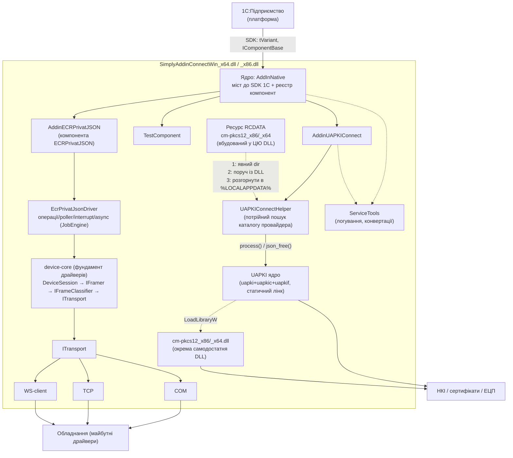

# Архітектура SimplyAddinConnect — індексний огляд

Цей документ — верхньорівнева карта архітектури. Він дає загальну картину і посилається
на детальні підсистемні доки. Тут навмисно стисло — усі подробиці (сигнатури, file:line,
особливості поведінки) винесені в окремі розділи.

> Джерело правди щодо кожної підсистеми — відповідний документ у цьому каталозі. Прикладна
> інтеграція з 1С (для розробника, що користується готовою компонентою) — окрема тека
> [docs/integration-1c/](../integration-1c/README.md).

---

## Що це

**SimplyAddinConnect** — нативна компонента-драйвер для підключення обладнання та
криптографічних сервісів до **1С:Підприємство**. Проєкт компілюється в **одну DLL**
(окремо для x86 і x64), яку 1С підключає як зовнішню нативну компоненту.

Усередині однієї DLL живе **кілька компонент** (кожна доступна в 1С під власним іменем),
що стоять на спільному ядрі-мості до SDK 1С:

- `AddinUAPKIConnect` — доступ до ЕЦП/криптографії через бібліотеку UAPKI;
- `TestComponent` — демо/приклад реєстрації (імена `AddInNative` / `SimplyAddinConnect` / `SimplyConnect`).

**Драйвери обладнання** будуються на спільному **фундаменті device-core** (`src/transport/`:
`ITransport` → `IFramer`/`NullTerminatedFramer` → `IFrameClassifier` → `DeviceSession`) поверх
платформи-каркаса (`src/platform/`: `ResultEnvelope`, `JobEngine`). Фундамент драйвер-незалежний —
див. [device-core.md](device-core.md). Перший драйвер на ньому — **ECRPrivatJSON**
([ecrprivatjson.md](ecrprivatjson.md), компонента 1С `ECRPrivatJSON`). Другий драйвер —
**LabelPrinter** ([label_printer.md](label_printer.md), компонента 1С `LabelPrinter`, БПО-фасад):
друк односпрямований і синхронний, тож `DeviceSession` він **не** задіює — перевикористовує лише
`ResultEnvelope` та `ITransport`.

У штатну підсистему **«Подключаемое оборудование»** драйвери входять через шаровані БПО-фасади
(`ECRPrivatBPO3004`, `ECRPrivatBPO4000`, `LabelPrinter`) — контракт і шарування описано в
[bpo-contract.md](bpo-contract.md).

UAPKI — **лише одна з підсистем**, а не суть усього проєкту. Архітектура шарова: верхні шари
не знають про деталі нижніх, зв'язок — через інтерфейси (`IComponentBase`, `ITransport`) і хелпери.

---

## Каталог підсистем

| # | Підсистема | Документ | Про що |
|---|---|---|---|
| 01 | Ядро (`AddInNative`) | [core.md](core.md) | Міст до SDK 1С, реєстр компонент, `VariantHelper`, модель методів/властивостей |
| 02 | Фундамент драйверів (device-core) | [device-core.md](device-core.md) | Транспорт/framer/класифікатор/`DeviceSession` + платформа `ResultEnvelope`/`JobEngine`; контракт для нових драйверів |
| 03 | Драйвер ECRPrivatJSON | [ecrprivatjson.md](ecrprivatjson.md) | Платіжний термінал ПриватБанк: кодек/класифікатор, `Connect`, операції/poller/interrupt/async, фасад `ECRPrivatJSON` |
| 04 | Драйвер LabelPrinter | [label_printer.md](label_printer.md) | Принтер етикеток (ZPL): БПО-фасад `LabelPrinter`, гібридний рендер (нативні штрихкоди + растр GDI+ у `^GF`), batch state machine, spooler-RAW/TCP:9100 |
| 04a | Контракт БПО | [bpo-contract.md](bpo-contract.md) | «Подключаемое оборудование»: імена системних методів, які РЕАЛЬНО кличе 1С (короткі, не `Equipment-*`), **шарування фасадів** (контракт → семантика → ревізія → протокол, §2.6), три формати XML, **єдина числова таксономія помилок** (§4.3), розбіжність із ІТС |
| 05 | UAPKI | [uapki.md](uapki.md) | ЕЦП/крипто: JSON-API `process()`, провайдер `cm-pkcs12`, потрійний пошук каталогу, **межа покриття тестами й два свідомі відступи від нормативу** (§8), **дві пастки бібліотеки** — два ідентифікатори ДСТУ-ключа й `TOTAL-VALID` у `STRUCT` (§9) |
| 06 | Збірка й пакування | [build-and-packaging.md](build-and-packaging.md) | Модульний CMake, `build_project.ps1`, ZIP + `manifest.xml`, доставка в 1С |

> Прикладна інтеграція з 1С (методи, приклади коду, тестування — для 1С-розробника) винесена в
> окрему теку [docs/integration-1c/](../integration-1c/README.md), по документу на драйвер.

---

## Загальна діаграма

---

## Шари

| Шар | Файли | Роль |
|---|---|---|
| Ядро (bridge) | `src/core/AddInNative.*` | Реалізація SDK 1С, реєстр компонент, `VariantHelper` |
| Компоненти | `src/components/*` | Фасади, що реєструють методи для 1С. Фасади **БПО** шаровані: `BpoFacadeBase` (контракт «Подключаемое оборудование») → `AcquiringFacadeBase` (семантика еквайрингу поверх `IAcquiringDriver`) → ревізійний шар (`AcquiringBpo3004`/`4000` — розкладка параметрів) → конкретний протокол (`EcrPrivatBpo3004`/`4000`). `AddinLabelPrinter` стоїть прямо на `BpoFacadeBase` — див. [bpo-contract.md §2.6](bpo-contract.md) |
| Device-core | `src/transport/{IFramer,NullTerminatedFramer,IFrameClassifier,DeviceSession}` | Фундамент драйверів: кадрування → класифікація → сесія запит/відповідь |
| Платформа драйверів | `src/platform/*` | Спільний каркас драйверів (`ResultEnvelope` — уніфікований результат операції) |
| Драйвери обладнання | `src/drivers/ecr_privatjson/*` | Пілотний ECRPrivatJSON: кодек JSON, класифікатор кадрів, `Connect`, операції/poller/interrupt/async поверх `JobEngine` |
| Компонента ECR (фасад) | `src/components/AddinECRPrivatJSON.*` | Компонента 1С `ECRPrivatJSON`: реєструє методи, делегує драйверу; poll-based стан операції (`OperationState`/`OperationResult`/`LastStatus`), `EnableTrace` — wire-трасування з наступного `Connect` |
| Хелпери | `src/helpers/*` | Допоміжна логіка (JSON, буфери, обгортки бібліотек) |
| Транспорт | `src/transport/*` | Канали зв'язку (COM/TCP/WebSocket-client) |
| Сервіси | `src/helpers/ServiceTools*` | Наскрізне логування та конвертації рядків |

Компонента — **тонка**: у конструкторі логує старт і викликає `RegisterMethods()`, у
деструкторі вимикає логування; сама лише транслює виклики 1С у відповідний протокол/хелпер
і формує відповідь. Уся важка логіка — нижче за шаром.

---

## Куди дивитись далі

- **[docs/integration-1c/](../integration-1c/README.md)** — інтеграція з 1С для прикладного розробника (методи компонент, приклади коду, тестування проти емуляторів).
- **[AGENTS.md](../../AGENTS.md)** — команди збірки, конвенції коду, як додати компоненту, розділ «Тести».
- **Специфікації протоколів:**
  - [ECR_Privat_JSON_Protokol.md](../ECR_Privat_JSON_Protokol.md) — протокол платіжного термінала ПриватБанку.
  - [`extern/uapki/doc/UAPKI-PM-2.0.16.md`](../../extern/uapki/doc/UAPKI-PM-2.0.16.md) — JSON-протокол UAPKI (методи, параметри, коди помилок; є й англійська версія). Прикладна інтеграція з 1С — [integration-1c/uapki.md](../integration-1c/uapki.md).
- **[tasks/](../tasks/)** — робочі звіти з імплементації (напр. `2026-07-19_uapki_fork_update_and_upstream_pr.md` — синхронізація форку UAPKI з upstream). Емпіричні факти про доставку в 1С — [build-and-packaging.md](build-and-packaging.md) §4.
- **[CMake/components.cmake](../../CMake/components.cmake)** — джерело правди щодо складу й залежностей компонент.
- **Скіли** (`.claude/skills/`): `1c-native-component`, `uapki-integration`, `ecp-testing-without-1c`, `prro-fiscal` — переносне ноу-хау.
