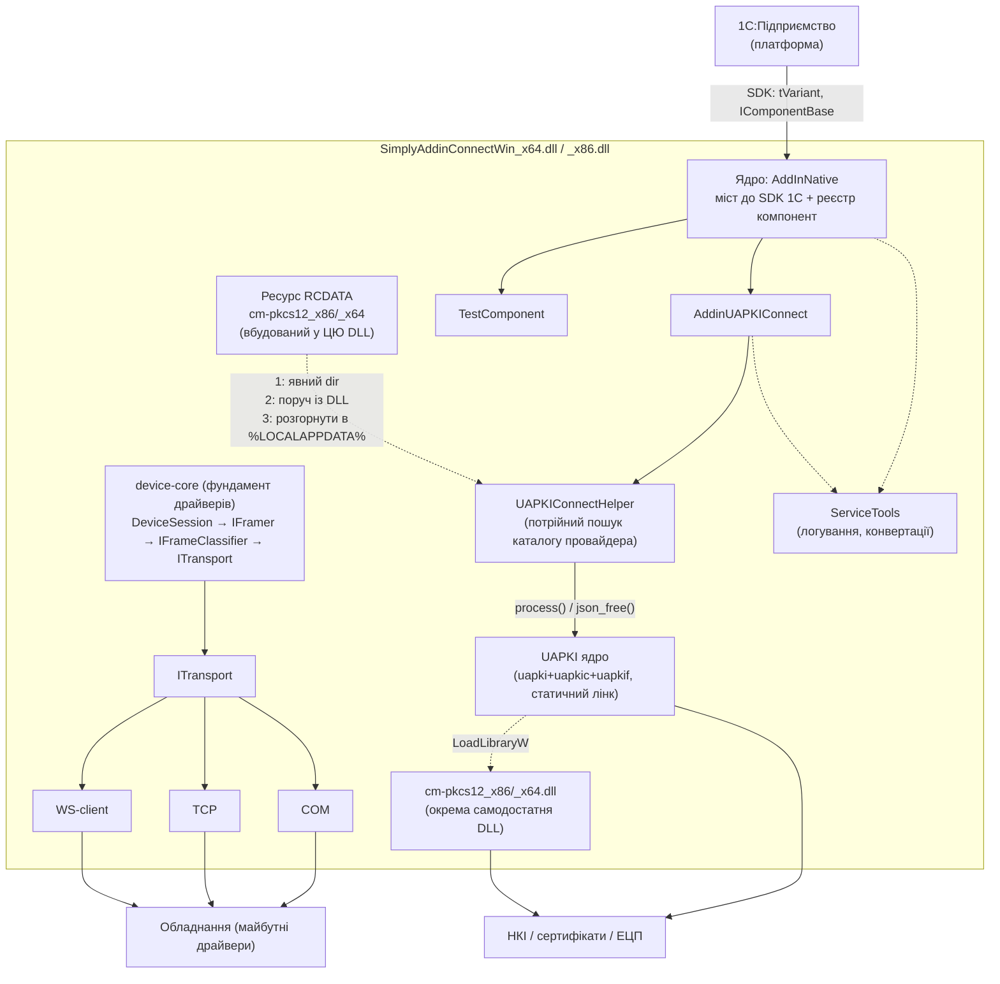

# Архітектура SimplyAddinConnect — індексний огляд

Цей документ — верхньорівнева карта архітектури. Він дає загальну картину і посилається
на детальні підсистемні доки. Тут навмисно стисло — усі подробиці (сигнатури, file:line,
особливості поведінки) винесені в окремі розділи.

> Стан коду відповідає гілці `device-core`.

---

## Що це

**SimplyAddinConnect** — нативна компонента-драйвер для підключення обладнання та
криптографічних сервісів до **1С:Підприємство**. Проєкт компілюється в **одну DLL**
(окремо для x86 і x64), яку 1С підключає як зовнішню нативну компоненту.

Усередині однієї DLL живе **кілька компонент** (кожна доступна в 1С під власним іменем),
що стоять на спільному ядрі-мості до SDK 1С:

- `AddinUAPKIConnect` — доступ до ЕЦП/криптографії через бібліотеку UAPKI;
- `TestComponent` — демо/приклад реєстрації (імена `AddInNative` / `SimplyAddinConnect` / `SimplyConnect`).

> **Драйвери обладнання (device-core).** Старий драйвер `AddinECRPrivatJSON` (платіжний
> термінал ПриватБанку) на гілці `device-core` **видалено як непрацездатний** — його
> заміняє **фундамент device-core** у `src/transport/`: байтовий транспорт `ITransport` →
> кадрування `IFramer`/`NullTerminatedFramer` → класифікація `IFrameClassifier` → сесія
> запит/відповідь `DeviceSession`. Це основа для майбутніх драйверів; конкретних компонент-
> драйверів (Privat тощо) поки нема.

UAPKI — **лише одна з підсистем**, а не суть усього проєкту. Архітектура шарова: верхні шари
не знають про деталі нижніх, зв'язок — через інтерфейси (`IComponentBase`, `ITransport`) і хелпери.

---

## Каталог підсистем

| # | Підсистема | Документ | Про що |
|---|---|---|---|
| 01 | Ядро (`AddInNative`) | [core.md](core.md) | Міст до SDK 1С, реєстр компонент, `VariantHelper`, модель методів/властивостей |
| 02 | ECRPrivatJSON (історичне) | [ecrprivatjson.md](ecrprivatjson.md) | Опис ВИДАЛЕНОГО старого драйвера термінала; заміняється фундаментом device-core (`src/transport/`) |
| 03 | UAPKI | [uapki.md](uapki.md) | ЕЦП/крипто: JSON-API `process()`, провайдер `cm-pkcs12`, потрійний пошук каталогу |
| 04 | Збірка й пакування | [build-and-packaging.md](build-and-packaging.md) | Модульний CMake, `build_project.ps1`, ZIP + `manifest.xml`, доставка в 1С |

---

## Загальна діаграма

---

## Шари

| Шар | Файли | Роль |
|---|---|---|
| Ядро (bridge) | `src/core/AddInNative.*` | Реалізація SDK 1С, реєстр компонент, `VariantHelper` |
| Компоненти | `src/components/*` | Фасади, що реєструють методи для 1С |
| Device-core | `src/transport/{IFramer,NullTerminatedFramer,IFrameClassifier,DeviceSession}` | Фундамент драйверів: кадрування → класифікація → сесія запит/відповідь |
| Хелпери | `src/helpers/*` | Допоміжна логіка (JSON, буфери, обгортки бібліотек) |
| Транспорт | `src/transport/*` | Канали зв'язку (COM/TCP/WebSocket-client) |
| Сервіси | `src/helpers/ServiceTools*` | Наскрізне логування та конвертації рядків |

Компонента — **тонка**: у конструкторі логує старт і викликає `RegisterMethods()`, у
деструкторі вимикає логування; сама лише транслює виклики 1С у відповідний протокол/хелпер
і формує відповідь. Уся важка логіка — нижче за шаром.

---

## Куди дивитись далі

- **[AGENTS.md](../../AGENTS.md)** — команди збірки, конвенції коду, як додати компоненту, розділ «Тести».
- **Специфікації протоколів:**
  - [ECR_Privat_JSON_Protokol.md](../ECR_Privat_JSON_Protokol.md) — протокол платіжного термінала ПриватБанку.
  - [UAPKI_Protokol.md](../UAPKI_Protokol.md) — JSON-протокол UAPKI (методи, параметри, коди помилок).
- **[tasks/](../tasks/)** — робочі звіти з імплементації (напр. `2026-07-19_uapki_embedded_providers_and_tests.md` — доведені емпіричні факти про поведінку 1С).
- **[CMake/components.cmake](../../CMake/components.cmake)** — джерело правди щодо складу й залежностей компонент.
- **Скіли** (`.claude/skills/`): `1c-native-component`, `uapki-integration`, `ecp-testing-without-1c`, `prro-fiscal` — переносне ноу-хау.
